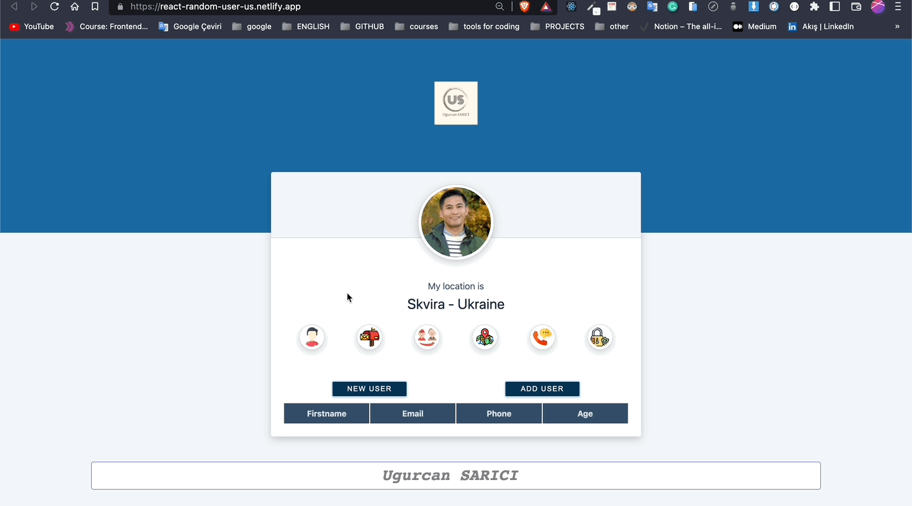

# Project : Random User App

## Table of contents

  - [The challenge](#the-challenge)
  - [Screenshot](#screenshot)
  - [Project Skeleton ](#project-skeleton)
  - [Links](#links)
  - [Built with](#built-with)
  - [Useful resources](#useful-resources)


## The challenge
Project aims to create a Random User  App with React.

## Problem Statement

- Develop a random user application using https://randomuser.me/api/. Use one button to bring in a new user and another button to add a user to the list
<hr>


## Project Skeleton 

```
Random User App  (folder)
|
|----readme.md         
│ 
├── public
│     └── index.html
├── src
│    ├── assets.js
│    │       └── [images]
│    ├── App.js
│    ├── App.css
│    ├── index.js
│    └── index.css
├── package.json
└── yarn.lock
```


## Screenshot
<p align="center">
<a href="https://react-random-user-us.netlify.app/"></a>
</p>


## Links
<hr>
<b>Check The Live Website ➡️</b> <a href="https://react-random-user-us.netlify.app/">Live Website</a>
<hr>

### Built with

- Components

- useState

- useEffect

- axios

- import/export

- Props

- React Developer Tool

- Destructuring props

- array map method


## Notes

- You can use HTML,CSS ,JAVASCRIPT and REACT to complete this project.

### Useful resources

- [W3 Schoold](https://www.w3schools.com/) 
- [MDN](https://developer.mozilla.org/en-US/) 
- [REACT](https://reactjs.org/) 


<center> &#8987; Happy Coding  &#9997; </center>
